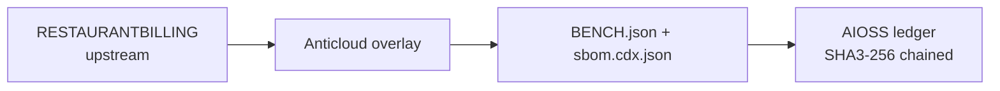

# RESTAURANTBILLING (Anticloud overlay)

  

**Upstream:** UNMEASURED @ UNMEASURED

**Category:** POS_SYSTEMS  **Vendor:** upstream (see provenance)

## Architecture

## Benchmarks (measured, with provenance)

| Check | Value | Source |
|---|---|---|
| files_scanned | 0 | BENCH.json metrics, run 2026-10-06T06:33:47.665935+00:00 |
| full metrics | see anticloud/08_BENCHMARK_MAPPING.md | BENCH.json |
| SBOM | sbom.cdx.json | bench engine |

No other benchmark number is claimed here. Anything not listed above is NOT YET MEASURED for this project.

## Contents

- `UPSTREAM_CLONE/` (untouched upstream source)
- `anticloud/` (overlay: CRDT, provenance, licence, security, deps, perf, CLI, bench map, SBOM, compliance, hygiene, rebrand)
- `BENCH.json`, `sbom.cdx.json`

## Provenance

- Upstream SHA: UNMEASURED
- Clone tree SHA3-256: see anticloud/02_PROVENANCE.json

## Contact

Anticloud overlay worker (group6). Upstream issues go to the upstream repository.
